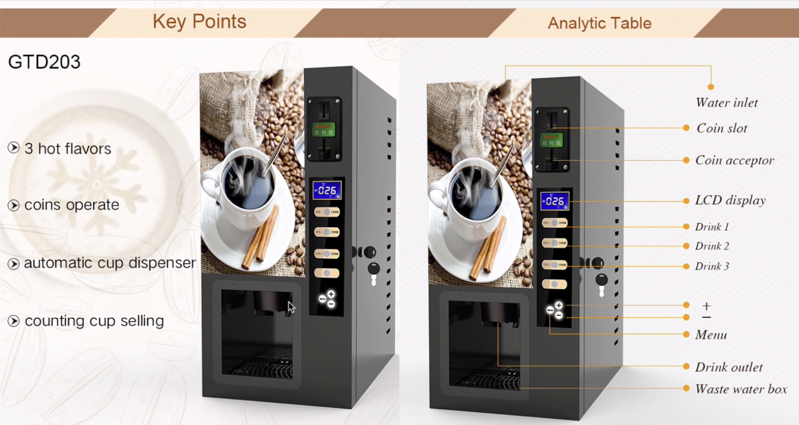

# Coffee Machine



Add the MENU and other at the beginning of `main.py` to use.

```python
MENU = {
    "espresso": {
        "ingredients": {
            "water": 50,
            "coffee": 18,
        },
        "cost": 1.5,
    },
    "latte": {
        "ingredients": {
            "water": 200,
            "milk": 150,
            "coffee": 24,
        },
        "cost": 2.5,
    },
    "cappuccino": {
        "ingredients": {
            "water": 250,
            "milk": 100,
            "coffee": 24,
        },
        "cost": 3.0,
    }
}

profit = 0
resources = {
    "water": 300,
    "milk": 200,
    "coffee": 100,
}

```

## Program Requirements

1. Print report
2. Check resources sufficient?
3. Process coins
4. Check transaction successful?
5. Make Coffee

## Coin Operated

- Penny: 1 cent = $0.01
- Nickel: 5 cents = $0.05
- Dime: 10 cents = $0.10
- Quarter: 25 cents = $0.25

## Instructions

1. Prompt user by asking “What would you like? (espresso/latte/cappuccino):”

a. Check the user’s input to decide what to do next.

b. The prompt should show every time action has completed, e.g. once the drink is dispensed. The prompt should show again to serve the next customer.

2. Turn off the Coffee Machine by entering “off” to the prompt.

a. For maintainers of the coffee machine, they can use “off” as the secret word to turn off the machine. Your code should end execution when this happens.

3. Print report.

a. When the user enters “report” to the prompt, a report should be generated that shows

the current resource values. e.g.

```
Water: 100ml
Milk: 50ml
Coffee: 76g
Money: $2.5
```

4. Check resources sufficient?

a. When the user chooses a drink, the program should check if there are enough
resources to make that drink.

b. E.g. if Latte requires 200ml water but there is only 100ml left in the machine. It should not continue to make the drink but print: “Sorry there is not enough water.”

c. The same should happen if another resource is depleted, e.g. milk or coffee.

5. Process coins.

a. If there are sufficient resources to make the drink selected, then the program should prompt the user to insert coins.

b. Remember that quarters = $0.25, dimes = $0.10, nickles = $0.05, pennies = $0.01

c. Calculate the monetary value of the coins inserted. E.g. 1 quarter, 2 dimes, 1 nickel, 2 pennies = 0.25 + 0.1 x 2 + 0.05 + 0.01 x 2 = $0.52

6. Check transaction successful?

a. Check that the user has inserted enough money to purchase the drink they selected.
E.g Latte cost $2.50, but they only inserted $0.52 then after counting the coins the
program should say “Sorry that's not enough money. Money refunded.”.

b. But if the user has inserted enough money, then the cost of the drink gets added to the machine as the profit and this will be reflected the next time “report” is triggered. E.g.

```
Water: 100ml
Milk: 50ml
Coffee: 76g
Money: $2.5
```

c. If the user has inserted too much money, the machine should offer change.
E.g. “Here is $2.45 dollars in change.” The change should be rounded to 2 decimal places.

7. Make Coffee.

a. If the transaction is successful and there are enough resources to make the drink the user selected, then the ingredients to make the drink should be deducted from the coffee machine resources.
E.g. report before purchasing latte:

```
Water: 300ml
Milk: 200ml
Coffee: 100g
Money: $0
Report after purchasing latte:
Water: 100ml
Milk: 50ml
Coffee: 76g
Money: $2.5
```

b. Once all resources have been deducted, tell the user “Here is your latte. Enjoy!”. If latte was their choice of drink.

## Running Scenario:

```
What would you like? (espresso/latte/cappuccino): report
Water: 300ml
Milk: 200ml
Coffee: 100g
Money: $0

What would you like? (espresso/latte/cappuccino): latte
Please insert coins
How many quarters?: 12
How many dimes?: 12
How many nickles?: 12
How many pennies?: 12
Here is $2.42 in change.
Here is your latte Enjoy!

What would you like? (espresso/latte/cappuccino): report
Water: 100ml
Milk: 50ml
Coffee: 76g
Money: $2.5

What would you like? (espresso/latte/cappuccino): cappuccino
Sorry there is not enough water.

What would you like? (espresso/latte/cappuccino): espresso
How many quarters?: 1
How many dimes?: 1
How many nickles?: 1
How many pennies?: 1
Sorry that's not enough money. Money refunded.

What would you like? (espresso/latte/cappuccino): espresso
Please insert coins.
How many quarters?: 12
How many dimes?: 4
How many nickles?: 4
How many pennies?: 4
Here is $2.14 in change.
Here is your espresso. Enjoy!

What would you like? (espresso/latte/cappuccino):
```
