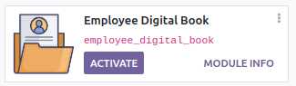
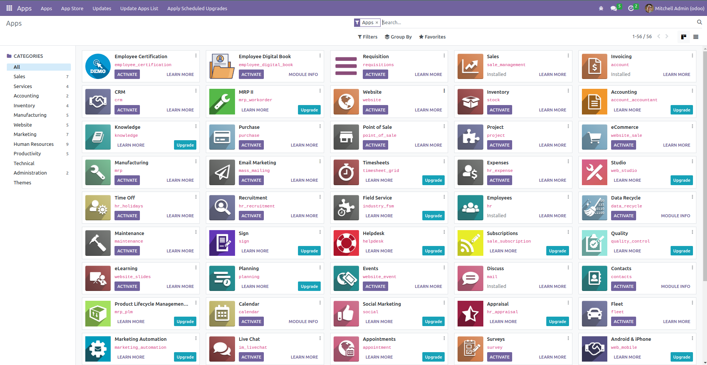
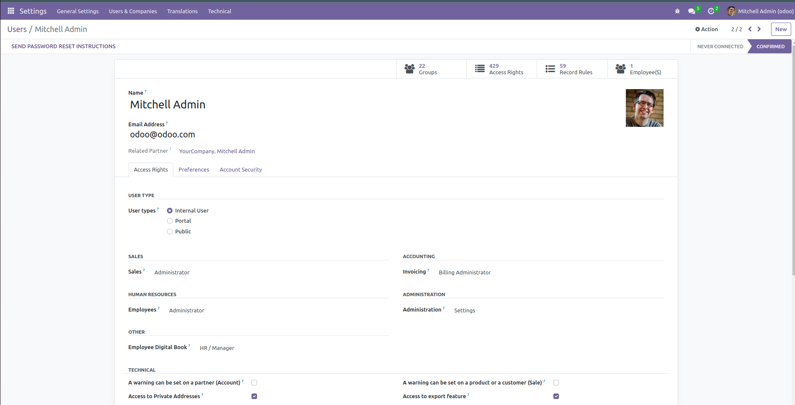
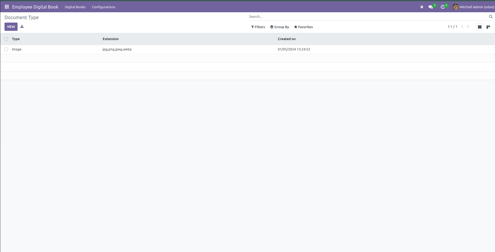
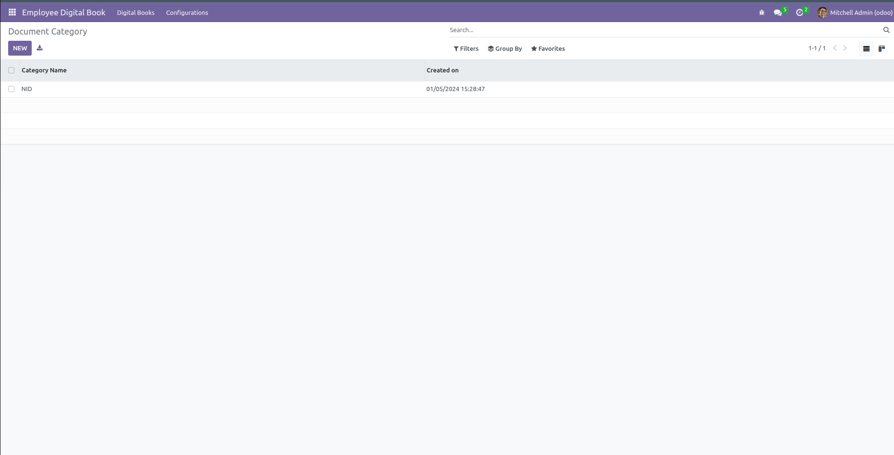
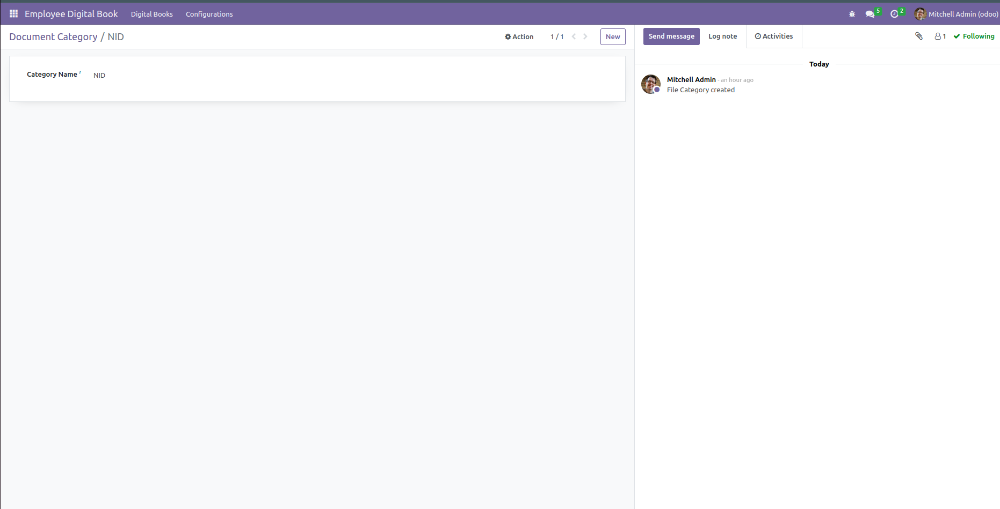
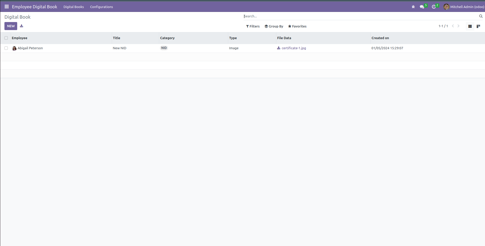
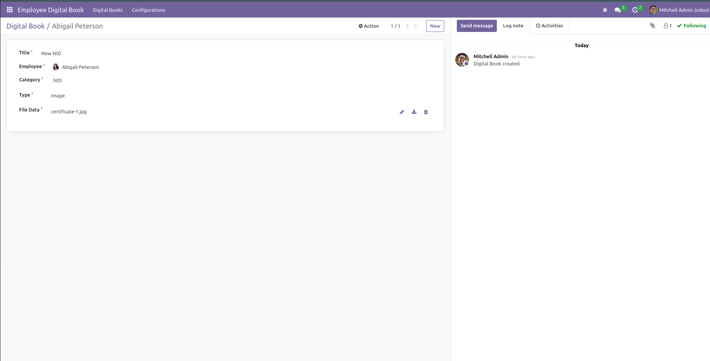
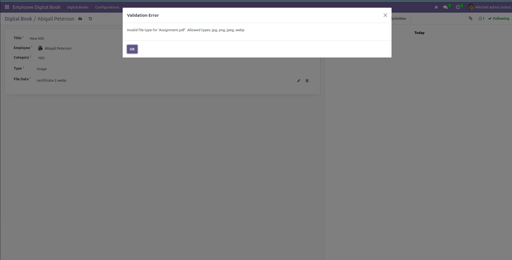
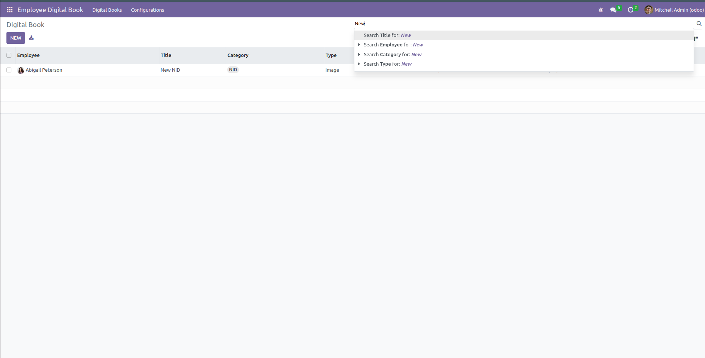

# Employee Digital Book for Odoo 16

## Overview

The Employee Digital Book module for Odoo 16 is a feature-rich solution designed to manage and organize digital documents associated with employees. This module enhances document categorization, file type management, and document access rights within the Odoo HR environment.



## Features

- **Document Management**: Attach and manage various documents directly under an employee's record.
- **Category Management**: Organize documents into categories for better management and retrieval.
- **Type Management**: Define different types of documents (like png, pdf, etc.) with specific file extensions.
- **File Validation**: Ensures that the files uploaded match the predefined file types and extensions.
- **Access Rights**: Control access to the module based on user roles, ensuring data security.
- **Activity Tracking**: The module inherits from `mail.thread` and `mail.activity.mixin` for tracking and managing user activities.

## Installation

To install this module, follow these steps:

1. Copy the module into your Odoo addons directory.
2. Add access rights for User to `HR / Manager` from `Setting > Users & Companies > Users`

## Configuration

The module introduces new configurations for managing document categories and types. Ensure that you configure these settings according to your organizational needs.

## Access Rights

Access to the Employee Digital Book module is controlled through specific user groups. Users in the 'HR / Manager' group have access rights to manage digital books, categories, and types.

## Usage

1. Navigate to 'Employee Digital Book' in the Odoo menu.
2. Create document categories under 'Configurations' to organize your documents efficiently.
3. Define document types to categorize files based on their nature and extensions.
4. Start attaching digital books to employees, ensuring proper categorization and type assignment.

## Features & Screenshot
- First Install `Employee Digital Book` module from apps.
    
- After that, Add access rights for User to `HR / Manager` from `Setting > Users & Companies > Users`
    
- Refresh the page and Navigate to `Employee Digital Book`
- Go to `Configuration > File Type`
    
- Add new Type by clicking `New`
    
- Then, Go to `Configuration > Category`
    
- Add new Category by clicking `New`
    
- Go to `Digital Books`
    
- Add new Document by clicking `New`
    
    - There is also validation implemented by Type 
  
- Also can Filter & Search
    


## Dependencies

This module depends on the 'hr' module in Odoo.

## License

This module is distributed under the LGPL-3 license.

---

**Module Details:**

```python
{
    'name': "Employee Digital Book",
    'version': '16.0.0',
    'summary': "Employee Digital Book",
    'sequence': 0,
    'author': "Bappi Saha",
    'description': """
    Employee Digital Book
    """,
    'category': 'Human Resource',
    'website': '',
    'depends': ['hr'],
    'data': [
        'security/security.xml',
        'security/ir.model.access.csv',
        'views/digital_book_category.xml',
        'views/digital_book_type.xml',
        'views/digital_book.xml',
        'views/menu_views.xml'
    ],
    'demo': [],
    'installable': True,
    'application': True,
    'license': 'LGPL-3',
}
